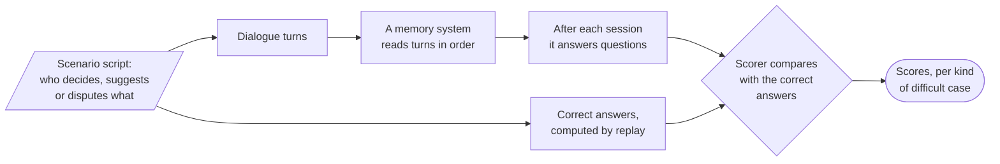

# TraceMem

TraceMem is a project assistant that remembers the decisions a team makes across many conversations. When the team changes its mind, TraceMem keeps the old decision as history, marks it as replaced, and answers with the current one, citing the conversation turn that settled it. This repository holds TraceMem and the benchmark that tests whether this kind of memory actually helps. It is a student group project for a university course on natural language processing.

## The problem in one example

A team decides to use BERT for a sentiment classifier. A few days later someone asks, "Maybe we could try DistilBERT?", and nobody agrees yet. Before the next meeting, someone asks the assistant which model the team is using. The right answer is still BERT.

A memory that finds statements by **similarity** to the question returns both messages, because both are about the model. It attaches no status to them and gives the newer one no special place, so the answer depends on the language model reading the wording correctly and seeing that "Maybe we could try" settles nothing. A memory that also prefers **recent** statements answers "DistilBERT", because the newest message is the unconfirmed suggestion. TraceMem keeps a status on every remembered decision, such as *active*, *proposed* or *replaced*, and answers "BERT" from the active one.

At the next meeting the team switches to DistilBERT, because BERT is too slow. TraceMem then marks BERT as replaced, answers "DistilBERT", and can still say which model came before.

The research question is whether this explicit bookkeeping gives fewer outdated or wrongly replaced answers than similarity search, with and without a preference for recent statements.

## What exists today

The repository currently contains the **evaluation scaffold**: everything needed to write test scenarios, compute their correct answers, run a memory system over them fairly, and score it. The memory components that call a language model are next, and each has an owner on the team.

| Part | Status | Where |
|---|---|---|
| Data contracts shared by every component | done | [`src/tracemem/schema.py`](src/tracemem/schema.py) |
| Scenario format, validator, and five example scenarios | done | [`benchmark/`](benchmark/), guide: [`docs/benchmark.md`](docs/benchmark.md) |
| Correct answers computed from each scenario's script | done | [`src/tracemem/bench/replay.py`](src/tracemem/bench/replay.py) |
| What the four memory operations do, and the memory store | done | [`src/tracemem/ops.py`](src/tracemem/ops.py) |
| Harness that runs any system under the same rules | done | [`src/tracemem/eval/harness.py`](src/tracemem/eval/harness.py) |
| Scoring, metrics and uncertainty intervals | done | [`src/tracemem/eval/`](src/tracemem/eval/), guide: [`docs/metrics.md`](docs/metrics.md) |
| Rule-based check systems ("probes") that test the scorer and the benchmark | done | [`src/tracemem/systems/probes.py`](src/tracemem/systems/probes.py) |
| TraceMem's pipeline, wired end to end with stand-in components | done | [`src/tracemem/pipeline.py`](src/tracemem/pipeline.py), [`components.py`](src/tracemem/components.py) |
| Language-model components: extraction, resolution, retrieval, answering | planned | interfaces in [`docs/interfaces.md`](docs/interfaces.md) |
| Comparison systems: similarity, similarity + recency, Timeline, full history | planned | [`docs/interfaces.md`](docs/interfaces.md#comparison-systems-planned) |
| The team's benchmark scenarios | planned | [`docs/benchmark.md`](docs/benchmark.md) |
| Demo interface | planned | |

The five example scenarios in `benchmark/scenarios/dev/` show the format. They are drafts for the team to review, not part of any result.

## Quick start

You need Python 3.11 or newer. Run every command from the repository root, the `tracemem` folder that `git clone` creates.

```bash
git clone https://github.com/jinjinjinjye/tracemem.git && cd tracemem
python3 -m venv .venv && source .venv/bin/activate
pip install -e ".[dev]"
pytest                                             # all tests, including the scorer's self-checks
tracemem validate                                  # check the example scenarios
tracemem replay benchmark/scenarios/dev/pilot-01-suggestion-after-decision.yaml
tracemem systems                                   # list the systems you can run
tracemem run --system pipeline-gold                # TraceMem's pipeline, built from stand-ins
tracemem run --system latest-candidate             # a rule that trusts the newest stored statement
tracemem report runs/*                             # compare the saved runs, with intervals
```

`tracemem replay` prints what the memory should contain after every turn and the correct answer to every question. It is the quickest way to see what a scenario tests. `tracemem blind` followed by a scenario file prints the dialogue and the questions without the script, for a reviewer who labels the scenario blind.

Both systems in the comparison read the benchmark's correct labels, so neither is a result. The report shows that the stand-in pipeline answers every question correctly, while the newest-statement rule gets wrong exactly the eight questions about the present where the newest stored statement is only a suggestion or a dispute.

## How an evaluation works



*One scenario's path through the evaluation. The system under test sees only the dialogue; only the scorer sees the correct answers.*

Four rules make the comparison fair, and the harness enforces each one:

1. Every scenario starts with a fresh system, so nothing carries over between scenarios.
2. A system sees turns one at a time, in order, and never a later turn.
3. Asking a question never changes what a system remembers.
4. No system except the probes and stand-ins ever sees a scenario's correct answers, its value lists, or which item a question is about.

## How this differs from the proposal (pending team ratification)

The repository departs from the project proposal in three ways. Each one is a proposal until the team records it in [`docs/decisions/`](docs/decisions/README.md).

- **Research question 3 asks about a different item in the same project, not about different projects.** Every system filters its memory by project id, so a statement from another project never reaches the answer model, and that case would test nothing. The benchmark instead tests pairs of similar items within one project, such as the sentiment model and the NER model.
- **The comparison systems are fixed.** They are similarity, similarity + recency, Timeline, TraceMem, TraceMem without supersession, and a full-history reference. [`docs/interfaces.md`](docs/interfaces.md#comparison-systems-planned) describes each one.
- **The scope is cut.** The demo gets a thin user interface. There is no human evaluation, except to check an automatic judge if the team uses one. Memory holds decisions and tasks only.

## Terms used in this project

| Term | Meaning |
|---|---|
| **Item** | One thing the team decides or tracks, such as the sentiment model or a task. Each has a stable key, e.g. `model.sentiment`. |
| **Decision, suggestion** | A decision settles an item's value ("Let's go with BERT"). A suggestion only proposes one ("Maybe DistilBERT?"). |
| **Operation** | What the memory does with a new statement: **ADD** it, **KEEP** the existing decision and note the new support, **SUPERSEDE** the old decision with a new one, or **FLAG** an unresolved disagreement. |
| **Record status** | Every remembered statement is *active*, *proposed*, *contested* (disputed), *superseded* (replaced) or *declined*. The status is worked out from the history of operations, never typed in. |
| **Script** | The author's list of what each turn does, such as "S2-T3 suggests DistilBERT". The correct answers are computed from it. |
| **Checkpoint question** | A question asked at the end of a session, such as "Which model are we using?" |
| **Trap** | A question where the newest related statement is *not* the answer: a later suggestion, a dispute, a passing mention, or a decision about a similar item. A memory that trusts the newest statement fails on traps. |
| **Probe** | A simple rule-based system that reads the correct answers or the script. Probes check that the scorer and the benchmark work; they are never compared with TraceMem. |
| **Stand-in** | A component that returns the correct output from the benchmark, so that each teammate can build a stage before the stage before it is finished. |

## The contracts you code against

Four files define how the parts of TraceMem talk to each other. A change to any of them is a *contract change*: it needs approval from every teammate whose code uses the changed part.

| File | Defines | Read |
|---|---|---|
| [`schema.py`](src/tracemem/schema.py) | every data type that passes between components: turns, candidates, operations, records, questions, answers | [interfaces](docs/interfaces.md) |
| [`components.py`](src/tracemem/components.py) | the five component interfaces (extract, match, resolve, retrieve, answer) and their stand-ins | [interfaces](docs/interfaces.md) |
| [`ops.py`](src/tracemem/ops.py) | what ADD, KEEP, SUPERSEDE and FLAG do, and which operations are rejected | [interfaces](docs/interfaces.md) |
| [`systems/base.py`](src/tracemem/systems/base.py) | the interface every compared system offers the harness: read a turn, answer a question | [interfaces](docs/interfaces.md#systems) |

To build a component, implement its interface and swap it into the pipeline in place of its stand-in. The system assembled entirely from stand-ins (`tracemem run --system pipeline-gold`) scores perfectly, so any drop in score after a swap comes from the component you replaced.

## Repository map

```text
src/tracemem/
  schema.py        data contracts
  components.py    component interfaces and stand-ins
  ops.py           the memory operations and the store
  pipeline.py      TraceMem's write and read paths
  bench/           loading, replaying and validating scenarios
  eval/            harness, scoring, metrics, intervals, reports
  systems/         runnable systems: probes and the stand-in pipeline
    base.py        the interface every compared system offers the harness
  cli.py           the `tracemem` command
benchmark/scenarios/
  dev/             development scenarios (five examples today)
  test/            held outside the repository until the freeze
docs/              guides and the team's working agreement
docs/decisions/    decision records
scripts/           repository checks run in CI
tests/             tests, including self-checks for the scorer
runs/              local run outputs, one folder per run (ignored by git)
results/           the committed log of test runs
```

## Working on this project

- [`docs/working-agreement.md`](docs/working-agreement.md): how the team makes decisions, protects the test set, and keeps results reproducible (proposed, awaiting ratification).
- [`CONTRIBUTING.md`](CONTRIBUTING.md): setup and pull-request checklist.
- [`docs/decisions/`](docs/decisions/README.md): the record of every decision that affects more than one person.
- [`AGENTS.md`](AGENTS.md): rules for AI coding assistants working in this repository.
