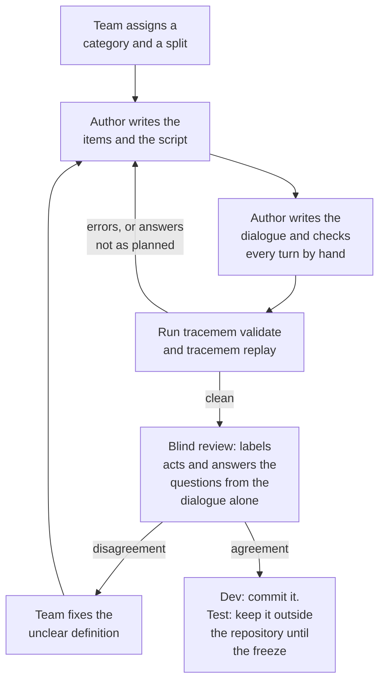

# Writing benchmark scenarios

This guide is for anyone who writes or reviews a TraceMem benchmark scenario. It assumes you have read the project proposal and nothing else. The [README](../README.md) introduces the project and its terms. This guide explains how a scenario is built, what each label means, and how the repository checks your work.

The scenario format is defined in [`schema.py`](../src/tracemem/schema.py), in the classes under "Scenario side". The checks live in [`bench/validate.py`](../src/tracemem/bench/validate.py), and the correct answers are computed by [`bench/replay.py`](../src/tracemem/bench/replay.py). Where this guide and the code disagree, the code is right and the guide needs fixing.

## 1. What a scenario is

A scenario is a short, made-up project told as a series of team meetings. Each meeting is a **session**, and each message in a session is a **turn**. During the meetings the team makes a few decisions and changes some of them. At the end of each session, the benchmark asks the memory system under test a **checkpoint question**, such as "Which model are we using for the sentiment classifier?"

A scenario file holds four things:

- the **items**: the things the team decides or tracks, such as the sentiment model or a task;
- the **dialogue**: the sessions and their turns;
- the **script**: a list that says what each relevant turn does to an item, for example "S2-T3 suggests DistilBERT";
- any checkpoint questions beyond the ones generated automatically.

Nobody writes a correct answer by hand. The command `tracemem replay` reads the script, works out what a perfect memory would hold after every turn, and takes the correct answers from that. This is why the script comes before the dialogue:

- The script decides every answer, so it is the part that must be exactly right. Writing it first lets you plan the hard cases on purpose.
- The dialogue then only has to say what the script says. It can be reworded, or rewritten by a language model, without changing any answer.
- A reviewer can label the dialogue without seeing the script, and the two labellings can be compared (section 9).

Five pilot scenarios in [`benchmark/scenarios/dev/`](../benchmark/scenarios/dev/) serve as worked examples: pilot-01 (a late suggestion about the sentiment model), pilot-02 (a disputed choice of dataset), pilot-03 (two models in one project), pilot-04 (tasks whose progress changes) and pilot-05 (questions and recollections around a baseline). They are drafts and have not been reviewed yet.

## 2. The file format

Each scenario is one YAML file (a plain-text format for structured data) with the `.yaml` extension; the tools also read `.yml`. Run every `tracemem` command from the repository root, because the default folders, such as `benchmark/scenarios/dev/`, are given relative to it. The excerpts below come from [pilot-01](../benchmark/scenarios/dev/pilot-01-suggestion-after-decision.yaml). In it, the team picks BERT, hears a suggestion to try DistilBERT, and switches one session later.

The file starts with a header:

```yaml
scenario_id: pilot-01
title: Classifier choice with a late suggestion
category: suggestion_after_decision   # one of the eight categories (section 7)
split: dev                            # dev or test; must match the folder (section 10)
author: pilot                         # who wrote it: a GitHub handle or a role
review: {status: unreviewed}          # unreviewed, reviewed or blind_checked
project_id: sentiment-project         # a name for the made-up project
```

`author`, and the `reviewer` inside `review`, take a GitHub handle or a role, such as `benchmark lead`, never a full name. The repository is public.

Next come the items (section 3) and then the sessions. A session has an id, a date and a list of turns. Session ids run `S1`, `S2`, and so on, in order. A session's date may not be earlier than the date of the session before it. A turn id is the session id plus a turn number that starts at 1, so `S2-T3` is the third turn of the second session. Speakers are made-up first names.

```yaml
  - id: S2
    date: 2026-10-08
    turns:
      - {id: S2-T1, speaker: Arun, text: "The first run finished, but inference takes about 40 ms per review."}
      - {id: S2-T2, speaker: Mei, text: "That's over our 25 ms latency budget."}
      - {id: S2-T3, speaker: Arun, text: "Maybe we could try DistilBERT? It might be faster."}
      - {id: S2-T4, speaker: Mei, text: "Possibly. I'd rather see numbers first."}
```

Aim for 3 to 12 turns per session; the validator warns outside that range. Include ordinary turns that change nothing, such as S2-T4 ("Possibly. I'd rather see numbers first."), because real meetings have them. The **harness**, the program that feeds turns to a system and asks the questions, gives each turn a made-up clock time. Session n starts at 10:00 plus (n-1) hours on its date, and each turn adds one minute, so S2-T3 is at 11:02. The clock keeps turns in order even when two sessions share a date, as long as no session has more than 60 turns.

The script lists one **event** per labelled turn. An event names the turn, its act (section 4), the item, and any fields the act needs:

```yaml
script:
  - {turn: S1-T1, act: decide, item: model.sentiment, value: BERT}
  - {turn: S2-T3, act: suggest, item: model.sentiment, value: DistilBERT}
  - {turn: S3-T2, act: revise, item: model.sentiment, value: DistilBERT, reason: "BERT exceeds the 25 ms latency budget"}
  - {turn: S3-T6, act: mention, item: model.sentiment, value: BERT}
```

A turn without an event, such as S2-T4, does nothing to the memory. The file ends with the hand-written questions (section 6). You may also add `auto_questions: false` to switch off the automatic ones.

## 3. Items

An item is one thing the team decides or tracks. Here is one from pilot-01:

```yaml
  - key: model.sentiment
    kind: decision
    description: classification model for the sentiment task
    ask: Which model are we using for the sentiment classifier?
    values:
      BERT: [bert-base, bert-base-uncased]
      DistilBERT: [distilbert-base-uncased, distil-bert]
      RoBERTa: [roberta-large, roberta]
    confusable_with: [model.ner]
```

- **`key`** is a stable name in lower case with at least one dot, such as `model.sentiment` or `task.label_audit`.
- **`kind`** is `decision` for a choice with a value, or `task` for a piece of work with a progress state.
- **`description`** says in one line what the item is. Systems may see it, so it must not name any value. The validator warns (`W-description-leak`) when it does.
- **`ask`** is the wording of the automatic checkpoint question for this item (section 6).
- **`values`** lists every value the item takes in the scenario. Each entry is a **canonical value**, the name the script uses, followed by its **aliases**, other spellings that also count. An answer of "distilbert-base-uncased" therefore counts as DistilBERT. Spellings are compared after lower-casing, collapsing spaces and stripping surrounding punctuation, and two values of one item may not share a spelling.
- **`confusable_with`** names other items that a reader could easily mix up with this one. In pilot-01, `model.sentiment` is linked to `model.ner`, the model that tags names of people and places (named-entity recognition, NER). List the link on both items, as the pilots do. A link listed on only one of the two items is an error (`E-confusable`).

A task item has no `values`. Its value is always one of four progress words: `open`, `blocked`, `completed` or `cancelled`. Everyday words also count for them, such as "done" for `completed` and "stuck" for `blocked` (`PROGRESS_ALIASES` in [`schema.py`](../src/tracemem/schema.py)).

**What systems never see.** Before the first turn, a system receives a `ScenarioMeta` ([`schema.py`](../src/tracemem/schema.py)). It holds the item keys, kinds and descriptions, or nothing at all when a run withholds them with `tracemem run --vocabulary none`. Each question reaches a system as a `SystemQuestion`: its text, its kind and, for `as_of` questions, its session. The question's id is scrambled, so it does not reveal which item the question is about.

Values, aliases and `confusable_with` labels never reach a system, because together they are the answer key. A list of values would tell a system which answers exist. A `confusable_with` label would tell it which items to keep apart, and that is one of the skills being tested. Only the **scorer**, the code that compares an answer with the correct one, reads them, and only after the system has answered.

## 4. The nine acts

An **act** says what a turn does to one item. The replay turns each act into one of four memory **operations**, defined in [`ops.py`](../src/tracemem/ops.py). Each operation acts on **records**, the stored memories:

- **ADD** stores a new record, either as the *active* (current) value or as a *proposed* one.
- **KEEP** confirms the active record and adds the turn as further evidence.
- **SUPERSEDE** stores a new active record and marks the old one *superseded*: replaced, but kept as history.
- **FLAG** stores a *contested* (disputed) claim. The item then has no settled answer until someone settles the dispute.

| Act | What the turn does | Example | Operation |
|---|---|---|---|
| `decide` | makes the first settled choice for an item | S1-T1 "Let's go with BERT for the sentiment classifier." | ADD as active |
| `revise` | settles on a new value in place of the current one | S3-T2 "Then we switch the sentiment classifier to DistilBERT..." | SUPERSEDE |
| `restate` | repeats the current value | S4-T1 "For the write-up: we're on DistilBERT..." | KEEP |
| `suggest` | puts a value forward without settling it | S2-T3 "Maybe we could try DistilBERT?" | ADD as proposed |
| `accept` | settles an earlier suggestion | S3-T4 "Agreed, macro-F1 is the primary metric from now on." | ADD as active, or SUPERSEDE if a value is current |
| `contest` | claims the current value is a different one, without settling it | pilot-02 S2-T1 "Wait, I thought we agreed on SST-2 last time, not IMDB." | FLAG |
| `mention` | names a value without proposing it | S3-T6 "Good. BERT was too slow anyway." | none |
| `task_open` | creates a task | pilot-02 S1-T3 "Priya, can you audit 200 labels...?" | ADD as active, progress `open` |
| `task_progress` | changes a task's progress | pilot-04 S2-T1 "The baseline runs are blocked..." | SUPERSEDE |

Examples without a scenario name come from pilot-01.

A `mention` produces no operation, so it never changes the memory. Label mentions anyway. A later mention of another value is exactly what misleads a system that searches raw turns, and the replay can only spot that trap if the mention is in the script (section 8).

**Acts allowed on each kind of item** (`ACTS_BY_KIND` in [`schema.py`](../src/tracemem/schema.py)). A decision allows every act except `task_open` and `task_progress`. A task allows every act except `decide` and `revise`. On a task, the `value` of a `suggest`, `contest`, `restate` or `mention` is a progress word. For example, pilot-04 S4-T2 ("Should we reopen the error analysis now that there's slack?") is a `suggest` with `value: open`.

**Fields each act needs** (`EVENT_FIELDS` in [`bench/validate.py`](../src/tracemem/bench/validate.py)). Every event has `turn`, `act` and `item`. Any event may add `reason`, a short note of why, which is stored with the record.

| Act | Needs | Must not have |
|---|---|---|
| `decide`, `revise`, `restate`, `suggest`, `contest`, `mention` | `value` | `accepts`, `progress` |
| `accept` | `accepts`: the suggestion's turn id | `value`, `progress` |
| `task_open` | nothing more | `value`, `accepts`, `progress` |
| `task_progress` | `progress` | `value`, `accepts` |

A `value` is always a canonical value, never an alias. The replay also checks that the events make sense in order, and reports a break as `E-script`:

- `decide` and `task_open` need an item with no active value. After that, use `revise` or `task_progress`.
- `revise` and `task_progress` need an active value, and must change it.
- `restate` must repeat the active value. A `suggest` of the active value is an error; label that turn `restate`.
- `contest` needs an active value that differs from the claim.
- `accept` must name a suggestion on the same item that has not already been adopted.
- A turn may carry at most one event per item, not counting mentions. The validator reports this one as `E-same-item-turn`.

No act turns a suggestion down. Leave a turn such as pilot-05 S1-T3 ("Let's keep it simple first.") without an event. The suggestion stays open and never becomes the answer, and the team can still accept it later.

## 5. Labelling conventions for hard cases

An act describes what a turn does, not its grammar. Three conventions settle the cases on which authors and reviewers most often disagree. Each compared system gives a language model written instructions for answering questions, its answer prompt. Every answer prompt must state these same three rules, so that the systems and the benchmark work from one definition.

**Function decides between a suggestion and a mention.** A turn that puts a value forward for the current plan is a `suggest`, even when it is phrased as a question. Pilot-05 S1-T2, "What if we used naive Bayes instead?", is a suggestion. A turn that names a value without proposing it is a `mention`. Mentions include:

- a recollection: "BERT was too slow anyway" (pilot-01 S3-T6);
- a question about the past: "Should we have tried bag of words instead of TF-IDF?" (pilot-05 S4-T1);
- a report: "Logistic regression gets 0.91 macro-F1 on the dev split" (pilot-05 S2-T1).

A quick test: if everyone answered "yes", would the plan change? If it would, the turn is a suggestion.

**A dispute stays open until someone settles it.** After pilot-02 S2-T1 ("Wait, I thought we agreed on SST-2 last time, not IMDB."), the correct answer to "Which dataset are we training on?" is that the team disagrees. A dispute is settled when someone states a value as final, or when the other side agrees. Wei's reply in S2-T2 ("Hmm, I remember IMDB. Let's check the notes before Friday.") does not settle it, because he repeats his memory and puts off the decision. The turn is not a `restate`. At most it is a `mention`, and a mention never settles anything, so the dispute is still open at the end of session 2. Wei settles it in S3-T1 ("I checked the notes: it was IMDB. We stay with IMDB."), which is a `restate`. If the team had agreed on SST-2 instead, that turn would be a `revise`. Once the dispute is settled, the item has one answer again, and the disputed claim is closed.

**An acceptance names the suggestion it accepts, and may come sessions later.** The `accepts` field holds the suggestion's turn id. Pilot-01 S3-T4 ("Agreed, macro-F1 is the primary metric from now on.") has `accepts: S3-T3`, the turn "Should we use macro-F1?". The suggestion may come from any earlier session, as long as it has not already been adopted. A turn that makes the change for its own reasons is a `revise` instead. Pilot-01 S3-T2 ("Then we switch the sentiment classifier to DistilBERT, since BERT misses the latency limit.") is labelled this way. Both labels make the value current, but only `accept` also cites the suggestion's turn as evidence for the answer.

## 6. Checkpoint questions

**Automatic questions.** For every item with an `ask` text, the replay generates a `current` question ("what holds now?") after each session. The questions start in the first session where the item has an event other than a mention, and continue to the last session. Each gets the id `<item key>@<session>`. For example, `model.sentiment@S2` is "Which model are we using for the sentiment classifier?", asked at the end of session 2. Pilot-01 gets eleven automatic questions this way.

The correct answer to a question is one of three things:

- a value;
- *none*, when nothing is settled yet, for example when only a suggestion exists;
- *conflict*, when a dispute is open.

A system may also decline to answer.

**Questions about the past.** Add these by hand under `questions:`. A `previous` question asks which value the current one replaced; its answer is *none* if the value was never replaced. An `as_of` question asks what held at the end of an earlier session, named in `session`. Only `as_of` questions have a `session`, and it may not be later than `after`, the session after which the question is asked.

```yaml
questions:
  - {id: model.sentiment@S3-previous, after: S3, kind: previous, item: model.sentiment,
     text: "Which model did we use before the current one, and why did we change?"}
  - {id: metric.primary@S4-asof-S1, after: S4, kind: as_of, session: S1, item: metric.primary,
     text: "What was our primary metric at the end of the first meeting?"}
```

A hand-written question with the same id as an automatic one replaces it.

**A question's text must not name the answer.** "Did we use BERT before DistilBERT?" hands the system both values. Write each question as a teammate would ask it without knowing the answer. The validator warns (`W-leak`) when a question's text names any value the question could be answered with, right or wrong: an accepted spelling, a replaced value, a suggested or disputed value, a similar item's value, or, on a question about the past, today's value.

## 7. The eight categories

Every scenario belongs to one **category**, the pattern it is built around (`Category` in [`schema.py`](../src/tracemem/schema.py)). Five categories are built around a **trap**, a question where the newest relevant statement is not the answer; section 8 explains the three kinds. The other three are **controls**, where the newest statement is expected to be right.

| Category | The scenario is built around | Kind |
|---|---|---|
| `suggestion_after_decision` | a suggestion after a decision | newer-record trap |
| `unresolved_contradiction` | a second speaker disputing a decision | newer-record trap |
| `confusable_items` | a similar item of the same kind, decided later | similar-item trap |
| `mention_after_decision` | later recollections, reports and questions about the past | newer-mention trap |
| `task_lifecycle` | tasks that open, get blocked, finish or are cancelled | any trap kind |
| `explicit_revision` | a change stated as "X instead of Y" | control |
| `implicit_revision` | a change stated without replacement words | control |
| `accepted_suggestion` | a suggestion accepted later, possibly sessions later | control |

An implicit revision reads like pilot-04 S2-T2 ("Then let's move experiments to the lab server."): the old value, Colab, is never named. Controls check that TraceMem does no worse than a recency rule on ordinary changes, so they need no trap. A scenario in any other category needs at least one trap question, or the validator warns (`W-no-trap`).

Each author writes one scenario per category. Every category is then written by several people, and no category depends on one author's habits. (This quota, like the split rule below, is a proposal until the team records it as a decision; see the working agreement, section 1.)

## 8. Traps

In a plain correction, such as "let's use the lab server instead of Colab", the newest statement is right. A memory that simply prefers recent statements already answers such a question correctly. These questions therefore cannot show whether TraceMem's record statuses help. The benchmark needs traps: questions where the newest relevant statement is *not* the answer.

The replay marks traps automatically, so authors never label them. There are three kinds.

**Newer record.** The newest statement that becomes a memory record is not the answer, because it is only a suggestion or a disputed claim. In pilot-01, the answer after session 2 is still BERT, but the newest record is the suggestion S2-T3 ("Maybe we could try DistilBERT?"). This trap fools a memory that trusts its newest record.

**Newer mention.** The newest record is right, but a later turn names another value without proposing it. In pilot-01, the answer after session 3 is DistilBERT, but the session's last turn, S3-T6, says "BERT was too slow anyway." This trap fools a memory that searches the raw turns for the newest one on the topic.

**Similar item.** The answer is settled, but a similar item has a newer record with a different value. In pilot-03, the sentiment model after session 2 is DistilBERT, but the newest model decision is S2-T1 ("For the product-name tagger, we'll fine-tune BERT."). This trap fools a memory that picks statements by topic.

The replay marks a newer-mention trap only on a question without a newer-record trap. A similar-item trap can occur together with either. `tracemem validate` prints how many questions carry each kind.

## 9. The authoring workflow



*The path of one scenario from assignment to acceptance; every loop goes back to the script, because the correct answers come only from the script.*

1. **Assign.** The team gives each author a category and a split (section 10).
2. **Write the script.** Write the items and the script first. Decide which turns decide, suggest, dispute, revise or mention what, and where the traps fall. Then fill in the session ids, dates and turn ids.
3. **Write the dialogue.** Write each turn by hand, or have a language model turn the script into dialogue. The language model must come from a different model family (a different developer's line of models) from the one under test, so that the scenarios do not share the tested model's phrasing. Either way, check every turn by hand against its event.
4. **Validate and replay.** Run both commands and fix every error:

   ```bash
   tracemem validate benchmark/scenarios/dev/my-scenario.yaml
   tracemem replay benchmark/scenarios/dev/my-scenario.yaml
   ```

   `validate` checks the file (section 11) and counts the trap questions. `replay` prints the operation behind every labelled turn. It then prints a table of every question with its correct answer, its replaced and unconfirmed values, and its traps. Read the table. If an answer or a trap is not what you planned, fix the script, never the table.
5. **Blind review.** Run `tracemem blind SCENARIO`, where `SCENARIO` is the path to the file. It prints the dialogue and the questions, without the script, the title or the category. A second teammate gets that output. From the dialogue alone, the reviewer labels the act of each turn and answers every checkpoint question. The author compares both with the script and the replay. A disagreement means a definition is unclear: the team fixes the definition in this guide, then rechecks the scenarios that relied on it. Afterwards, set `review` to `status: blind_checked` and fill in `reviewer` (a GitHub handle or a role) and `notes`. Use `status: reviewed` for an ordinary review with the script in view.

## 10. Development and test scenarios

**Development** scenarios live in `benchmark/scenarios/dev/`. Anyone may read them, and the team builds and tunes its systems on them. **Test** scenarios produce the reported results. Systems run on them only after the **freeze**, the point at which the team tags the repository `freeze-v1` and stops changing prompts and settings.

People who write or tune any compared system author development scenarios only. Tuning includes writing prompts, choosing how a system's context is formatted, and setting retrieval options. These people also never open or review a test scenario. Someone who has read a test scenario could tune a prompt to it without meaning to, and the test result would then overstate how well the system handles new conversations.

Test scenarios stay outside this public repository until the freeze. Before the freeze comes **sealing**, the moment the test set is closed to further edits. At sealing, the team commits only one file, `SHA256SUMS`, to `benchmark/scenarios/test/`. The file lists a SHA-256 digest for each test file. A digest is a 64-character fingerprint computed from a file's contents, and changing a single character in the file changes the fingerprint. After the freeze tag, the scenarios themselves are committed. Anyone can then run `sha256sum -c SHA256SUMS` to confirm that no scenario was edited after sealing ([test folder README](../benchmark/scenarios/test/README.md)).

The code backs these rules up in three places:

- A file's `split` field must match its folder (`E-split-folder`).
- For files in a `test/` folder, `tracemem validate` prints each issue's code and general meaning but not the detailed message, so its output does not reveal their content.
- `tracemem run --split test` refuses to run while the repository has uncommitted changes, or has no `freeze-*` tag and no explicit override. Every test run is logged.

## 11. Validation codes

`tracemem validate` checks every scenario file it is given, or every file in `benchmark/scenarios/dev/` by default. Codes that start with `E` are errors: they make the command fail, and with it the automatic checks that run on every pull request. Codes that start with `W` are warnings: they are printed, but the command passes. `tracemem run` also validates every scenario of the split first, and refuses to run while any file has an error. The list is `ISSUE_CODES` in [`bench/validate.py`](../src/tracemem/bench/validate.py).

| Code | Meaning |
|---|---|
| `E-schema` | the file does not match the scenario format, for example a misspelt field name or a malformed id |
| `E-duplicate-id` | a session, turn, item or question id is used twice |
| `E-turn-session` | a turn id does not start with its session's id |
| `E-order` | sessions or turns are numbered out of order |
| `E-date` | a session is dated before the session before it |
| `E-unknown-turn` | an event's `turn` or `accepts` names a turn that does not exist |
| `E-unknown-item` | an event or question names an item that does not exist |
| `E-act-kind` | the act is not allowed on this kind of item (section 4) |
| `E-fields` | an event lacks a field its act needs, or has one it must not have |
| `E-value` | the value is not a canonical value of the item, or not a progress word for a task |
| `E-alias-collision` | two values of one item share a spelling |
| `E-same-item-turn` | one turn has two events on the same item, not counting mentions |
| `E-script` | the events break an act's rule, for example a `revise` with nothing to revise |
| `E-question` | a question's `session` or `after` does not fit its kind |
| `E-confusable` | `confusable_with` names an unknown item or the item itself, or the link is listed on only one of the two items |
| `E-split-folder` | the `split` field does not match the folder the file is in |
| `W-no-trap` | a scenario outside the control categories has no trap question |
| `W-leak` | a question's text names a value it could be answered with, right or wrong (section 6) |
| `W-session-length` | a session has fewer than 3 or more than 12 turns |
| `W-alias-shared` | two confusable items share a spelling of a value |
| `W-description-leak` | an item's description, which systems see, names one of the item's values |

The replay rules behind `E-script` run only once a file has no other errors, so fix the other errors first.
