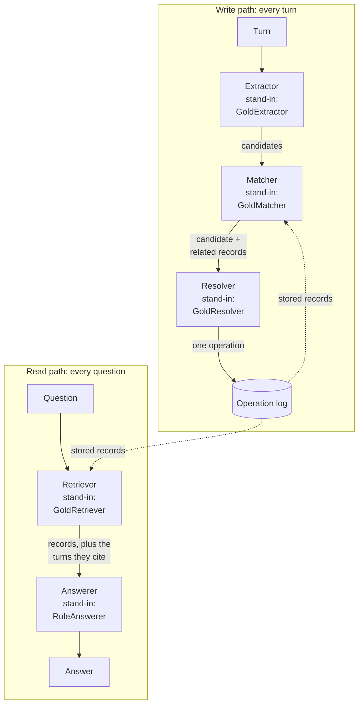
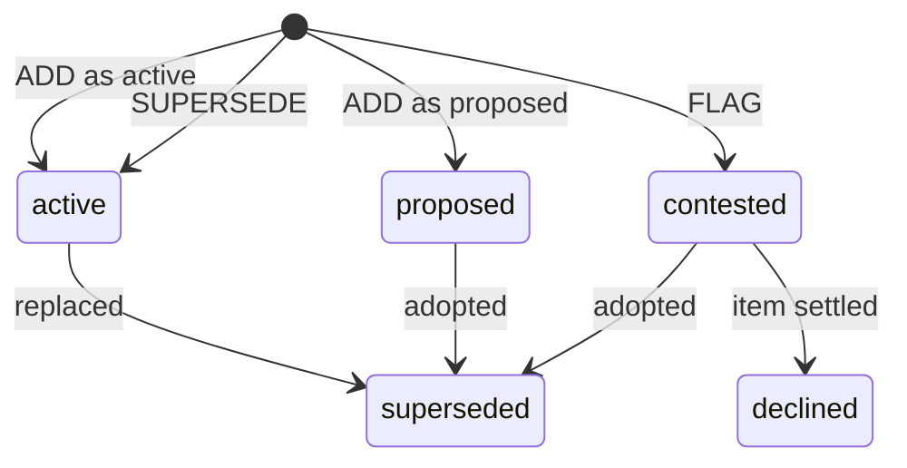

# Interfaces and contracts

This page is for a teammate who builds one part of TraceMem, and for any reader who wants to see how the parts fit together. It lists the data types that pass between the parts, the methods each part must provide, and the rules the memory store enforces. Everything described here is already implemented under [`src/tracemem/`](../src/tracemem/), except the section marked *planned*. Where this page and the code disagree, the code is right, and this page needs a fix.

## Words used on this page

- **Scenario**: a scripted project conversation over several meetings. The author labels what each turn does (this labelling is the script) and lists questions to ask between meetings. The five pilot scenarios in [`benchmark/scenarios/dev/`](../benchmark/scenarios/dev/) are worked examples.
- **Item**: one thing the team decides or tracks, named by a key such as `model.sentiment` (which model classifies sentiment). A decision item holds a choice. A task item holds a progress value: `open`, `blocked`, `completed` or `cancelled`.
- **Session and turn**: a session is one dated meeting, and a turn is one message in it. The id S2-T3 means session 2, turn 3; in the first pilot scenario, pilot-01, that is Arun saying "Maybe we could try DistilBERT?".
- **Candidate**: a statement from a turn that may be worth remembering, reduced to an item and a value.
- **Operation**: one change to memory, such as "store this value as a proposal". There are four kinds: ADD, KEEP, SUPERSEDE and FLAG.
- **Record**: one stored memory. It holds an item, a value, a status and the turns it came from.
- **Operation log**: TraceMem's store. It keeps every operation in order and never deletes one. The records and their statuses are computed from it.
- **Gold**: the correct labels a scenario author wrote, and everything computed from them: the right candidates, the right operations and the right answers. The replay ([`bench/replay.py`](../src/tracemem/bench/replay.py)) walks through the script and computes these.
- **Stand-in**: a component that returns the gold output instead of computing it. It lets a teammate build a component before the component that feeds it exists.
- **Baseline**: a comparison system that TraceMem is measured against, such as a similarity-based memory (it fetches the stored statements most similar to the question) or a recency-based memory (it prefers the newest statement). The planned set is listed under [Comparison systems](#comparison-systems-planned).
- **Harness**: the program that feeds a scenario's turns to a system in order, asks it questions between sessions, and saves the run ([`eval/harness.py`](../src/tracemem/eval/harness.py)).
- **Scorer**: the code that compares each answer with the gold answer ([`eval/classify.py`](../src/tracemem/eval/classify.py), [`eval/metrics.py`](../src/tracemem/eval/metrics.py)).

## The picture: a write path and a read path

TraceMem handles every turn on a write path and every question on a read path. On the write path, the extractor reads the turn and returns zero or more candidates. For each candidate, the matcher finds the stored records it may relate to, and the resolver chooses one operation. The operation log then applies that operation, or rejects it if it breaks a rule ([see below](#when-the-store-rejects-an-operation)). On the read path, the retriever picks the records that bear on the question, within a token budget (a cap on how much text it may pass on, counted in the units a language model reads). The answerer reads those records, plus the turns they cite, and returns a structured answer. The class `TraceMemPipeline` in [`pipeline.py`](../src/tracemem/pipeline.py) wires the five components together in this way.



*Solid arrows pass data from one component to the next, dotted arrows read the store, and each box names the stand-in that can take its place.*

## Where the contracts live, and how one changes

The contracts sit in four files:

- [`schema.py`](../src/tracemem/schema.py) defines every data type that passes between components, or between a system and the harness. It uses Pydantic, a Python library that checks each field's type when an object is built. Every type forbids unknown fields, so a misspelt field raises an error instead of vanishing. Every object is also frozen: to change a field, build a copy with `obj.model_copy(update={...})`.
- [`components.py`](../src/tracemem/components.py) defines the five component interfaces, the read-only view of the store (`StoreView`), and the stand-ins.
- [`ops.py`](../src/tracemem/ops.py) defines what each of the four operations does, and implements the operation log (`OpLog`).
- [`systems/base.py`](../src/tracemem/systems/base.py) defines the interface every compared system offers to the harness.

A component never passes data in any other shape. A component that needs a new field asks for a contract change and does not add the field locally. A change to any of the four files, `schema.py`, `components.py`, `ops.py` or `systems/base.py`, is a contract change, and it follows one route ([working agreement, section 2](working-agreement.md#2-interfaces-are-contracts)). The owner opens a pull request labelled `contract-change`. Every owner who uses the changed type approves it. The same pull request updates the tests and their sample data. The pull request merges only when the automatic checks pass. If the meaning of a field changed, the owner also files a [decision record](decisions/README.md).

## The types a system sees

**What the harness gives a system.**

| Type | Field | Meaning |
|---|---|---|
| `ScenarioMeta` | `scenario_id`, `project_id` | Which scenario and which project the turns belong to. |
| | `items` | A list of `ItemInfo` (below); empty when the vocabulary setting is `none`. |
| | `vocabulary` | `keys` or `none`: whether item keys were given ([see below](#what-systems-never-see)). |
| `ItemInfo` | `key` | The item's key, e.g. `model.sentiment`. |
| | `kind` | `decision` or `task`. |
| | `description` | One line, e.g. "classification model for the sentiment task". |
| `Turn` | `id` | The turn id, e.g. `S2-T3`. |
| | `speaker` | Who spoke, e.g. `Arun`. |
| | `text` | What they said. |
| `SystemQuestion` | `question_id` | An opaque id such as `q-45e1502b8394`, which reveals nothing about the item ([see below](#what-systems-never-see)). |
| | `scenario_id` | The scenario the question belongs to. |
| | `kind` | `current` (what holds now), `previous` (what held before the current value) or `as_of` (what held at the end of an earlier session). |
| | `text` | The question, e.g. "Which model are we using for the sentiment classifier?". |
| | `session` | For `as_of` only: the session the question asks about, e.g. `S1`. |

**What components pass to each other.**

| Type | Field | Meaning |
|---|---|---|
| `Candidate` | `candidate_id` | Must be `<item>@<turn id>`, where the turn is the one being read, e.g. `model.sentiment@S2-T3` ([see below](#systems-without-a-resolver)). |
| | `project_id` | The project. |
| | `item`, `value` | What the statement is about and the value it names, e.g. `model.sentiment` and `DistilBERT`. |
| | `source_turn_ids` | The turns it comes from; at least one. |
| | `speaker` | Who made the statement. |
| | `text` | The source turn's text, quoted. |
| `Operation` | `op_id` | A unique id. The gold uses `op:<record id>`. |
| | `op` | `ADD`, `KEEP`, `SUPERSEDE` or `FLAG`. |
| | `turn_id` | The turn being observed when the resolver issued it. A new record takes its id from this turn. |
| | `item`, `value` | The item, and the value the operation stores or confirms. |
| | `add_as` | For ADD only: `active` (settled) or `proposed` (suggested, not yet settled). |
| | `targets` | The ids of existing records the operation acts on. |
| | `source_turn_ids` | The turns the operation rests on. For an acceptance, both the "OK, let's do that" turn and the suggestion. |
| | `reason` | The reason given in the conversation, if any; copied onto the new record. |
| | `rationale` | The resolver's own explanation, free text; kept in the log, not on the record. |
| | `candidate_id` | The candidate that led to this operation. |
| `Record` | `record_id` | `<item>@<turn id>`, e.g. `model.sentiment@S1-T1`. |
| | `project_id`, `item`, `value` | As above. |
| | `status` | `active`, `proposed`, `contested`, `superseded` or `declined`; `None` in stores without a resolver. |
| | `source_turn_ids` | The turns that support the record; KEEP adds later turns here. |
| | `speakers` | The speaker of each source turn, in the same order. |
| | `created_turn`, `created_at` | The turn and time at which the record was created. |
| | `supersedes` | The ids of the records this one replaced or adopted. |
| | `reason` | The reason for the change, if one was given. |

**What a system returns.**

| Type | Field | Meaning |
|---|---|---|
| `Answer` | `status` | `answer` (a value is settled), `none` (nothing is settled yet), `conflict` (the team disagrees and nobody has settled it) or `abstain` (the system declines). |
| | `value` | The value asserted. It is present exactly when `status` is `answer`; anything else raises an error. |
| | `cited_turn_ids` | The turns the system gives as evidence. The scorer checks that each was already observed. |
| | `context_turn_ids` | The turns behind everything the answer model saw. The scorer uses it to check whether retrieval found the evidence. |
| | `text` | A free-text answer for human readers. |
| | `usage` | A `Usage`, or `None` for systems that call no model. |
| `Usage` | `calls` | The number of model calls behind the answer. |
| | `input_tokens`, `output_tokens` | Tokens sent and received, for the cost report. |

## Scorer-side types

The harness keeps two further types for the scorer. **Systems never receive them.**

| Type | Main fields | Meaning |
|---|---|---|
| `Question` | `question_id`, `item`, `after`, `kind`, `text`, `session` | The question with its readable id (e.g. `model.sentiment@S2`), the item it is about, and the session after which the harness asks it. `for_system()` turns it into a `SystemQuestion`. |
| `ExpectedAnswer` | `expected_status`, `expected_value` | The gold answer, computed by replaying the script ([`bench/replay.py`](../src/tracemem/bench/replay.py)). |
| | `accepted_values` | Forms that count as correct: the value and its aliases (other names for it, e.g. `bert-base` for BERT), lower-cased and trimmed. |
| | `stale_values`, `unconfirmed_values`, `confusable_values`, `current_values` | Forms that mark a known mistake: a replaced value, a value that was only suggested or disputed, another item's value, or today's value given to a question about the past. |
| | `required_support`, `additional_support` | The turns an answer should cite. |
| | `trap_candidate`, `trap_mention`, `trap_confusable` | Whether a simple "take the newest" rule would get this question wrong, and why. |
| | `episode` | Shared by repeated questions about the same unchanged state, so the metrics can count them once. |

For example, pilot-01's question `model.sentiment@S2` expects `BERT` after session 2. It lists the DistilBERT forms as unconfirmed, because Arun only suggested DistilBERT at S2-T3. The three trap flags name different ways a "take the newest" rule fails: the newest statement that would be stored is wrong (candidate), a later passing mention names another value (mention), or a similar item changed more recently (confusable).

## What systems never see

The benchmark's answers must not leak into a system. The harness therefore never gives a system:

- **Item values or aliases.** In pilot-01 a system may learn that `model.sentiment` is "classification model for the sentiment task". It never learns that BERT, DistilBERT and RoBERTa are the options, or that "bert-base" counts as BERT.
- **Confusable labels.** An author marks items that are easy to mix up as confusable. A system never learns that `model.sentiment` and `model.ner` are such a pair.
- **The item a question is about.** `SystemQuestion` has no item field, and its id is an opaque code such as `q-45e1502b8394`. The code is a hash of the scenario id and the readable question id, mixed with a salt: a random string that each replay draws afresh and keeps from systems. The same question therefore gets a new code in every run. Only systems that read the gold timeline can map a code back to its question, through `GoldTimeline.public_id` in [`bench/replay.py`](../src/tracemem/bench/replay.py); `GoldRetriever` does exactly that. Any other system must work out the item from the question text. The per-item question wording is withheld too, so a system cannot map that text straight back to an item.
- **Gold.** The script's labels, the gold candidates (except in the `gold_candidates` condition), the gold operations and the expected answers all stay with the harness.
- **Later turns.** A system sees each turn only when the harness passes it.

The vocabulary setting controls the item keys. With `--vocabulary keys`, the default, `ScenarioMeta.items` lists every item's key, kind and description. With `--vocabulary none`, the list is empty, and the system must name items itself. The scorer judges answers by their status, value and cited turns, never by item keys, so answer scores work in both settings. Each run records the setting as `item_vocabulary_given_to_systems` in its `manifest.json`, the file that lists a run's settings. Which setting the reported results use is a team decision.

## Systems

A system is anything the harness can run: TraceMem, a baseline, or a probe (rule 4 below). Every system offers the interface below ([`systems/base.py`](../src/tracemem/systems/base.py)). It is written as a Python protocol: a named set of methods. Any class with those methods fits, without inheriting from anything.

```python
class MemorySystem(Protocol):
    name: str
    def observe(self, turn: Turn, when: datetime, gold_candidates: list[Candidate] | None = None) -> None: ...
    def answer(self, question: SystemQuestion) -> Answer: ...
```

`observe` receives one turn and its time. The time is synthetic: session n starts at 10:00 plus (n-1) hours on its date, and each turn adds one minute, so a session holds at most 60 turns. `gold_candidates` is filled only in the `gold_candidates` condition. `answer` receives a `SystemQuestion`, never the scorer's `Question`.

A system may also provide these optional methods, called hooks. The harness uses each one if it exists.

| Hook | What the harness does with it |
|---|---|
| `fingerprint() -> str` | Compares it before and after each answer, to prove that answering changed nothing. |
| `operations() -> list[Operation]` | Saves the applied operations to `ops.jsonl` (a file with one JSON object per line). |
| `rejected_operations() -> list[tuple[Operation, str]]` | Saves the operations the store refused, each with its reason, to `rejected_ops.jsonl`. |
| `candidates() -> list[Candidate]` | Saves the candidates to `candidates.jsonl`. |
| `describe() -> dict` | Saves the system's settings in the manifest as `system_config`. |
| `accepts_gold_candidates = True` | Allows the system to run in the `gold_candidates` condition. |

A system joins the registry in [`systems/__init__.py`](../src/tracemem/systems/__init__.py) as a `SystemSpec`. The spec holds a name, a factory, a `uses_gold` flag and a description. The factory is a function that takes `(ScenarioMeta, GoldTimeline | None)` and returns a new system; `GoldTimeline` is everything the replay computed from the script. `tracemem systems` lists the registered systems.

The harness applies four rules to every system:

1. **A fresh start per scenario.** The harness calls the factory again for every scenario, so nothing carries over from one scenario to the next.
2. **Strict order.** The harness passes turns strictly in order. It asks a session's questions only after that session's last turn.
3. **A question is not a turn.** The harness never passes a question to `observe`. If a system's fingerprint changes while it answers, the harness stops the run with `AnswerMutatedState`.
4. **Gold only where allowed.** The harness passes gold candidates only in the `gold_candidates` condition. It passes the gold timeline only to systems registered with `uses_gold=True`. Those are the probes and the `pipeline-gold` mock. A probe is a simple rule that reads the gold labels to test the scorer and the benchmark; for example, `oracle` must score perfectly, and `always-oldest` must be stale exactly where its first value was replaced and not later restored. Every report labels them as probes or mocks, never as baselines.

Each run goes to a new folder under `runs/`, named by time, system, split (`dev` or `test` scenarios) and condition. It holds `manifest.json` (the settings, code version and scenario file hashes), `answers.jsonl` (each question, its gold answer, the system's answer and the outcome) and `metrics.json`. It also holds `ops.jsonl` and `candidates.jsonl` when the system has those hooks, and `rejected_ops.jsonl` when the store rejected at least one operation.

## The five components

Each component is also a protocol, so any class with the right method fits.

```python
class Extractor(Protocol):
    def extract(self, turn: Turn, when: datetime, meta: ScenarioMeta) -> list[Candidate]: ...
class Matcher(Protocol):
    def match(self, candidate: Candidate, store: StoreView) -> list[Record]: ...
class Resolver(Protocol):
    def resolve(self, candidate: Candidate, related: list[Record]) -> Operation: ...
class Retriever(Protocol):
    def retrieve(self, question: SystemQuestion, store: StoreView, budget_tokens: int) -> list[Record]: ...
class Answerer(Protocol):
    def answer(self, question: SystemQuestion, records: list[Record], turns: dict[str, Turn]) -> Answer: ...
```

| Component | Its job | Typical owner | Stand-in, and what it returns |
|---|---|---|---|
| Extractor | Turn to candidates. It reads no store, so every system can receive the same candidates. | extraction owner | `GoldExtractor`: the gold candidates of the turn. |
| Matcher | Candidate to the stored records it may be about. It should use the same search as the retriever. | resolution and store owner | `GoldMatcher`: every record of the candidate's item. |
| Resolver | Candidate and those records to exactly one operation. | resolution and store owner | `GoldResolver`: the gold operation for that candidate id. |
| Retriever | Question to the records the answerer may see, within `budget_tokens` (2,000 by default). | retrieval and answering owner | `GoldRetriever`: every record of the question's gold item, which no real retriever can know. |
| Answerer | Question, records and the turns those records cite to an `Answer`. | retrieval and answering owner | `RuleAnswerer`: a fixed rule on record statuses, with no language model. |

The answerer never reads the whole conversation. The pipeline hands it only the retrieved records and the turns those records cite.

The matcher and the retriever read the store through `StoreView`, which declares one attribute and four methods. `turn_times` maps every observed turn id to its time. `records(item=None)` lists records, optionally for one item. `items()` lists the items that have records. `item_state(item)` returns an `ItemState`: the active record, the open proposals and disputes, the closed records, whether the item has an open dispute, and the record the active one replaced. `upto(last_turn_id)` returns the store as it stood after that turn, which a retriever needs for an `as_of` question; `GoldRetriever` uses it this way. `OpLog` implements `StoreView`.

## Building on the stand-ins, one replacement at a time

The registered system `pipeline-gold` is the pipeline built entirely from stand-ins. After the setup in [CONTRIBUTING.md](../CONTRIBUTING.md), run it from the repository root:

```bash
tracemem run --system pipeline-gold
```

On the five pilot scenarios, it answers all 52 questions correctly. That result proves the wiring and gives the reference point. To test your component, register a copy of the pipeline in which only your component is real:

```python
def _pipeline_my_resolver(meta, gold):
    return TraceMemPipeline(meta, GoldExtractor(gold), GoldMatcher(), MyResolver(),
                            GoldRetriever(gold), RuleAnswerer(), name="pipeline-my-resolver")

# Add this spec to the list that builds REGISTRY in src/tracemem/systems/__init__.py:
SystemSpec("pipeline-my-resolver", _pipeline_my_resolver, True, "mock: stand-ins except the resolver")
```

Run it the same way and compare the two saved runs with `tracemem report runs/<first> runs/<second>`. Because only one component changed, any change in score comes from that component. Replace one stand-in per step. While any stand-in remains, the spec keeps `uses_gold=True`, because the stand-ins need the gold timeline and the harness passes it only then.

## The two conditions

The harness runs a system in one of two conditions, chosen with `--condition`:

- **`end_to_end`** (the default): the system reads the raw turns and runs its own extractor. This measures the whole system.
- **`gold_candidates`**: the harness gives each system the gold candidates for each turn, and the system skips its extractor. This isolates everything after extraction. For example, at pilot-01's S2-T3 every system receives the same candidate, `model.sentiment = DistilBERT` from Arun. Whether that candidate becomes a proposal or overwrites BERT then depends only on the memory design.

Only systems with `accepts_gold_candidates = True` can run in the `gold_candidates` condition; `TraceMemPipeline` has it.

## Operations and record statuses

The four operations are defined in [`ops.py`](../src/tracemem/ops.py):

- **ADD** creates a record. With `add_as="active"` the value is settled; with `add_as="proposed"` it is only suggested. An ADD that settles a value may also target open proposals with the same value; those proposals are adopted and closed.
- **KEEP** reaffirms the active record. It creates no record. It adds the new turns to the active record's sources, and it closes any open dispute as declined.
- **SUPERSEDE** creates a new active record that replaces the old one. When the item has an active record, SUPERSEDE must target it. It may also target open proposals or disputed claims that carry the new value, which it adopts.
- **FLAG** creates a contested record: someone disputes the active value without settling the matter. The item counts as disputed while any contested record is open.

Two pilots show all four operations in the gold: pilot-01 (a classifier choice with a late suggestion) and pilot-02 (a contested dataset choice).

| Turn | What was said | Gold operation |
|---|---|---|
| pilot-01, S1-T1 | Mei: "Let's go with BERT for the sentiment classifier." | ADD as active: `model.sentiment = BERT`, record `model.sentiment@S1-T1` |
| pilot-01, S2-T3 | Arun: "Maybe we could try DistilBERT?" | ADD as proposed: `DistilBERT` |
| pilot-01, S3-T2 | Mei: "Then we switch the sentiment classifier to DistilBERT, ..." | SUPERSEDE: `DistilBERT`, targeting the BERT record and the DistilBERT proposal |
| pilot-01, S3-T6 | Mei: "Good. BERT was too slow anyway." | none: a passing mention produces no candidate |
| pilot-02, S2-T1 | Priya: "Wait, I thought we agreed on SST-2 last time, not IMDB." | FLAG: `dataset.train = SST-2`, against the IMDB record |
| pilot-02, S3-T1 | Wei: "I checked the notes: it was IMDB. We stay with IMDB." | KEEP: `IMDB`; the SST-2 claim becomes declined |

The operation log checks every operation before applying it, and rejects one that breaks any of these rules:

1. Every turn the operation cites must already have been observed.
2. Every target must exist and belong to the same item.
3. ADD, SUPERSEDE and FLAG need a value. Each creates the record `<item>@<turn id>`, so an item gets at most one new record per turn.
4. ADD needs `add_as`, and no other operation may carry it. ADD as active is allowed only when the item has no active record. Only an ADD as active may have targets, and they must be open proposals with the same value.
5. KEEP must target exactly the active record. If it carries a value, the value must equal the active value.
6. SUPERSEDE needs at least one target and must include the active record, if there is one. Every target must still be open. Every target other than the active record must carry the new value. The new value must differ from the active value.
7. FLAG needs an active record, must target exactly that record, and must carry a different value.

A record's status is derived: the log computes it from the operations each time, and no code sets it by hand. A status therefore never disagrees with the history.



*A record starts as active, proposed or contested, may close once as superseded or declined, and never reopens.*

- **active**: the settled value. An item has at most one active record.
- **proposed**: suggested, not settled. Only adoption closes a proposal; pilot-02's Yelp suggestion stays proposed to the last session.
- **contested**: a disputed claim against the active value, still open.
- **superseded**: replaced by a newer active record, or adopted into one. The value stays in the history, which is how the answerer can say what came before.
- **declined**: a disputed claim that lost. The item settled again, by KEEP or by a SUPERSEDE that did not adopt the claim.

Record ids are deterministic: a record created at turn S1-T1 for `model.sentiment` is always `model.sentiment@S1-T1`. A system therefore numbers its records exactly as the gold does, and the scorer can compare the two. Any other store must produce the same item states from the same operations as `OpLog`.

## Systems without a resolver

The baselines, such as a similarity-based memory and a recency-based memory, have no resolver. Their store is `flat_records(project_id, candidates, turn_times)` from [`ops.py`](../src/tracemem/ops.py). It returns one record per candidate, with `status=None`. It names each record after the candidate's item and first source turn, so the record ids, values, turns and speakers match those TraceMem would build from the same candidates.

Every extractor must give each candidate the id `<item>@<turn id>`, using the id of the turn being read. The gold candidates have this form, and `GoldResolver` finds the gold operation for a candidate by its id. A candidate whose id the gold does not contain, such as an extra statement the extractor found or an id in another form, is stored as a proposal (an ADD as proposed) instead of crashing the run. An id in another form therefore turns even a correct candidate into a proposal.

TraceMem and the baselines should differ in one thing only: whether a resolver assigned statuses, and how retrieval uses them. So every system that shows records to an answer model must turn records into text the same way. That means the same fields, in the same order, within the same token budget. Otherwise, a better score could come from nicer formatting rather than from the resolver. The shared function for this already exists: `render_records(records, turns, show_status)` in [`components.py`](../src/tracemem/components.py). It writes one line per record, in time order: the turn id, the speaker, the item, the value, the status in brackets when `show_status` is true, and the quoted text of the turn that created the record. Every record-based system must use it. A system without a resolver passes `show_status=False`.

## Comparison systems (planned)

These systems are not built yet; so far only TraceMem's pipeline exists, wired from stand-ins. The list is a proposal until the team records it in a [decision record](decisions/README.md). An *embedding* is a list of numbers that represents a text's meaning, so that texts with similar meanings get nearby lists.

- **Similarity**: shows the records most similar to the question by embedding, with no status.
- **Similarity + recency**: the same, but each record's score adds a term that favours newer records. Its parameters are tuned on development scenarios only.
- **Timeline**: shows every record of the items its retriever selects, oldest first, with no status. The answer model works out what still holds when it reads them.
- **TraceMem**: the same item selection as Timeline, with each record's status shown.
- **TraceMem without supersession**: an ablation, a copy of TraceMem with one part removed to measure that part. Its resolver may only add records.
- **Full history**: gives the answer model every turn so far. It is a reference point, not a record-based system.

All record-based systems use the same extracted candidates, the same renderer (`render_records`) and the same token budget.

## When the store rejects an operation

`OpLog.apply` checks an operation before changing anything. If the operation breaks a rule, it raises `InvalidOperation` and leaves the log exactly as it was. `TraceMemPipeline` catches that error, keeps the operation together with the reason, and moves on to the next candidate. A bad operation from the resolver therefore never crashes a run. It simply changes nothing, and the answers show the effect. The pipeline returns the kept operations from `rejected_operations()`, and `operations()` lists only the operations that were applied. The harness saves the rejected operations in `rejected_ops.jsonl` in the run folder, one per line, each with a `rejection` field that holds the reason.
