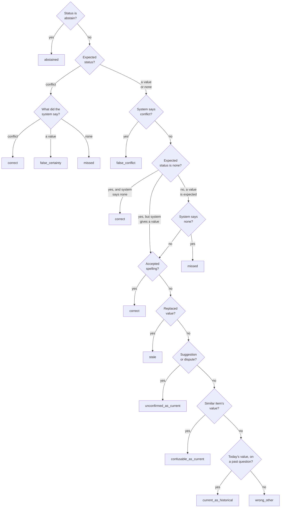

# How answers are scored

This page explains how the scorer judges each answer a memory system gives, and what each reported number means. It is written for a teammate who has read the project proposal, and for any member of the public reading the code. The scoring code is in [`src/tracemem/eval/`](../src/tracemem/eval/). The data types it reads are in [`src/tracemem/schema.py`](../src/tracemem/schema.py). Words such as *item*, *turn*, *record* and *gold* (the correct labels and everything computed from them) are defined in [interfaces.md](interfaces.md#words-used-on-this-page).

The numbers serve three research questions (RQs):

- **RQ1.** Does TraceMem give fewer outdated answers and fewer wrong replacements than a memory that retrieves by similarity, with and without a preference for recent statements?
- **RQ2.** Does it answer questions about the present and about the past, citing the right turns as evidence?
- **RQ3.** Which kinds of update does the resolver get wrong? The resolver is the component that decides whether a new statement adds, confirms, replaces or disputes a stored decision.

## 1. Structured answers make scoring exact

A system does not answer in free text alone. It returns an [`Answer`](../src/tracemem/schema.py) with these fields:

| Field | Holds |
|---|---|
| `status` | `answer`, `none`, `conflict` or `abstain` (section 2) |
| `value` | the value alone, such as `DistilBERT`; present exactly when `status` is `answer` |
| `cited_turn_ids` | the turns given as evidence, such as `S3-T2` |
| `context_turn_ids` | the turns behind everything the answering model saw (optional) |
| `text` | a readable answer for people; never scored |
| `usage` | model calls and tokens, for cost reports; never scored |

The value has its own field, so the scorer can compare it with a list of accepted spellings. No person or language model has to judge free text. Before comparing, the scorer normalises the value: it lowercases it, turns runs of spaces into one space, and strips punctuation at either end. Each scenario file lists other spellings (aliases) for its values, so `distilbert-base-uncased` counts as DistilBERT. For tasks, everyday words also count: "done" means `completed`. The field must hold only the value. `We use DistilBERT` matches no spelling and is scored as a wrong value.

Nobody writes the expected answer by hand. `tracemem replay` computes it from the scenario's script, the author's label for what each turn does, such as "S2-T3 suggests DistilBERT" ([`bench/replay.py`](../src/tracemem/bench/replay.py)). The replay also lists the tempting wrong values, so the scorer can say *which* mistake a system made. Here is the [`ExpectedAnswer`](../src/tracemem/schema.py) for pilot-01's question `model.sentiment@S4` ("Which model are we using for the sentiment classifier?", asked after session S4):

| Field | Meaning | Value in this example |
|---|---|---|
| `expected_status`, `expected_value` | the correct status and value | `answer`, DistilBERT |
| `accepted_values` | spellings that count as correct | distilbert, distil-bert, distilbert-base-uncased |
| `stale_values` | spellings of values that were replaced | bert, bert-base, bert-base-uncased |
| `unconfirmed_values` | open suggestions, open disputes, and disputes the team set aside | (none) |
| `confusable_values` | values of a similar item, here the NER model | spacy, spacy model, spacy ner |
| `current_values` | questions about the past only: today's value | (none) |
| `required_support` | turns that established the answer | S2-T3 ("Maybe we could try DistilBERT?") and S3-T2 ("Then we switch the sentiment classifier to DistilBERT..."), which accepts it |
| `additional_support` | turns that later restated it | S4-T1 ("For the write-up: we're on DistilBERT...") |
| trap flags, `episode` | see sections 4 and 6 | newer-mention trap; the item's third episode |

A question id such as `model.sentiment@S4` names the automatic question about one item, asked after one session. Authors can add explicit questions with longer ids, such as `model.sentiment@S3-previous`. Every question has one of three kinds. A `current` question asks what holds now. A `previous` question asks for the value before the current one. An `as_of` question asks what held at the end of a named earlier session. The last two are the *historical* questions.

## 2. The four answer statuses

| Status | What the system claims | A pilot question where it is correct |
|---|---|---|
| `answer` | "The value is X." | pilot-01 `model.sentiment@S1`: BERT, from Mei's S1-T1 ("Let's go with BERT for the sentiment classifier.") |
| `none` | "Nothing is settled", or for `previous`, "it never changed" | pilot-02 `dataset.train@S4-previous` ("Which dataset, if any, did we train on before the current one?"): it never changed |
| `conflict` | "The team disagrees and has not settled it." | pilot-02 after S2: Priya's S2-T1 ("Wait, I thought we agreed on SST-2 last time, not IMDB.") disputes Wei's IMDB |
| `abstain` | "I cannot tell." | never; every expected answer has one of the other three statuses |

For a `current` question, `none` is correct when the item has suggestions but no decision yet.

## 3. Outcome classes

The scorer puts every answer into exactly one of ten outcome classes ([`eval/classify.py`](../src/tracemem/eval/classify.py)). Every rate in section 5 counts these classes, not raw values. Each class names a different failure. A system that forgets (`missed`) therefore looks different from one that is over-cautious (`false_conflict`) or one that trusts an old statement (`stale`).

Most examples below name the probe that makes the mistake. Probes are simple rule-based systems, described in section 8.

- **`correct`**: the status matches, and any value is an accepted spelling. *Example:* `distilbert-base-uncased` for pilot-01 `model.sentiment@S3`.
- **`stale`**: a replaced value, given as current. *Example:* always-oldest answers BERT for pilot-01 `model.sentiment@S3`, although Mei's S3-T2 switched the model to DistilBERT.
- **`unconfirmed_as_current`**: a suggestion, an open dispute or a set-aside dispute, given as the settled value. *Example:* latest-candidate answers DistilBERT for pilot-01 `model.sentiment@S2`, taken from Arun's S2-T3 ("Maybe we could try DistilBERT?").
- **`confusable_as_current`**: another item's value. *Example:* BERT as the answer to pilot-03 `model.sentiment@S2` ("Which model are we using for sentiment?"). BERT belongs to the product-name tagger, from Lin's S2-T1 ("For the product-name tagger, we'll fine-tune BERT.").
- **`current_as_historical`**: asked about the past, gave today's value. *Example:* latest-candidate answers spaCy for pilot-03 `model.ner@S4-previous` ("Which model, if any, did we use for tagging product names before the current one?"). The correct answer is BERT.
- **`false_certainty`**: the team disagrees, and the system picked a side. *Example:* for pilot-02 `dataset.train@S2`, always-oldest answers IMDB and latest-candidate answers SST-2. The correct status is `conflict`.
- **`false_conflict`**: the matter is settled, or nothing is settled yet, and the system reported a conflict. *Example:* always-conflict on pilot-01 `model.sentiment@S1`, right after Mei's S1-T1 chose BERT.
- **`missed`**: something is settled or disputed, and the system said nothing is. *Example:* always-none on the same question.
- **`abstained`**: the system declined to answer. No probe does this, but a language-model system may.
- **`wrong_other`**: any other value. *Example:* latest-mention answers RoBERTa for pilot-01 `model.sentiment@S4`, taken from Arun's S4-T2 ("Out of curiosity, how would RoBERTa-large have done on this?"). Nobody ever proposed RoBERTa.

**Precedence.** One spelling can sit in several lists. The scorer then takes the first match in this order: accepted, stale, unconfirmed, confusable, today's value, anything else. The replay applies the same order when it builds the lists. *Example:* in pilot-04, Ana cancels the error analysis at S3-T2, then asks at S4-T2 "Should we reopen the error analysis now that there's slack?". The value `open` is now both a replaced value (the task was open from S1-T3) and a fresh suggestion. So latest-candidate's answer `open` for `task.error_analysis@S4` counts as `stale`.

*How the scorer turns one answer into one outcome class; the top-to-bottom order of the value checks is the precedence rule.*

## 4. Question subsets: where recency fails

Every scenario belongs to one *category*, such as "suggestion after decision" ([benchmark.md](benchmark.md#7-the-eight-categories)). Categories are quotas for authors: they fix how many scenarios of each kind the team writes. A scenario still contains ordinary questions. For example, pilot-01 asks about its evaluation metric after S1, when nothing tricky has happened yet. Comparisons therefore use flags on single questions, which the replay computes from the script (`trap_flags` in [`bench/replay.py`](../src/tracemem/bench/replay.py)).

A *trap* is a question where the rule "trust the newest statement" gives a wrong answer. The replay sets three flags:

| Flag | Set when | Fools | Pilot example |
|---|---|---|---|
| `trap_candidate` (newer record) | the newest statement that becomes a record is not the answer | similarity + recency | pilot-01 `model.sentiment@S2`: Arun's S2-T3 suggests DistilBERT, but BERT still holds |
| `trap_mention` (newer mention) | the newest record is right, but a later turn names another value | a memory that reads raw turns | pilot-01 `model.sentiment@S3`: Mei's S3-T6 says "BERT was too slow anyway." |
| `trap_confusable` (similar item) | the answer is settled, but a similar item has a newer record | ranking by topic similarity | pilot-03 `model.sentiment@S2`: Lin's S2-T1 picks BERT for the tagger |

The first two flags never appear together. The similar-item flag can join either one; pilot-01 `model.sentiment@S2` carries both `trap_candidate` and `trap_confusable`.

The scorer computes every metric on six subsets (`SUBSETS` in [`eval/metrics.py`](../src/tracemem/eval/metrics.py)): `all`, the three flags, `any_trap` (at least one flag) and `no_trap` (no flag). On `no_trap` questions the newest statement is right, so TraceMem can at best tie with a recency rule there. TraceMem can only win on trap questions, so the main comparisons read the trap subsets. The five pilots have 46 current questions: 8 carry `trap_candidate`, and 28 carry no flag. `tracemem validate` prints these shares for any set of scenarios.

## 5. The metrics

Every metric is a rate or a mean over a stated set of questions, called its denominator ([`METRICS` in eval/metrics.py](../src/tracemem/eval/metrics.py)). If the denominator is empty, the tools print `n/a`, never 0. Next to each value they print `n`, the number of questions in the denominator. Refusals (`missed`, `false_conflict`, `abstained`) stay in every denominator. Below, *settled* means that the expected status is `answer`.

Which number answers which research question:

| Question | Main number | Subset | Read beside |
|---|---|---|---|
| RQ1, against plain similarity | `stale_answer_rate` | `all` | `non_answer_rate` |
| RQ1, against similarity + recency | `presented_as_current_rate` | `trap_candidate` | `non_answer_rate` |
| RQ1, wrong replacements | `incorrect_replacement_rate` | `all` | `non_answer_rate` |
| RQ2 | `historical_accuracy`, `supported_answer_rate` | `all` | `citation_validity` |
| RQ3 | resolver metrics (section 9, planned); `false_certainty_rate` for disputes until then | `all` | `false_conflict_rate` |

### Questions about the present

**`current_accuracy`**: how often a current question gets a correct answer.
Denominator: every `current` question. Numerator: `correct`.
Reading: the overall health check. TraceMem should match recency on `no_trap` and beat it on `trap_candidate`.

**`stale_answer_rate`**: how often a replaced value is given as current.
Denominator: settled current questions whose item has at least one replaced value. Numerator: `stale`.
Reading: RQ1's key comparison against plain similarity, which retrieves old and new decisions alike. Lower is better.

**`incorrect_replacement_rate`**: how often a suggestion, a dispute or another item's value takes the place of the right answer.
Denominator: current questions whose expected status is not `conflict` and that hold a temptation. A temptation is an expected status of `none`, an unconfirmed value, or a similar item with values. Numerator: `unconfirmed_as_current` plus `confusable_as_current`.
Reading: RQ1's "wrong replacements". The metric looks at answers, not at memory operations, so systems without a resolver also get a score. Lower is better.

**`presented_as_current_rate`**: how often a wrong value is presented as the settled one.
Denominator: every `current` question. Numerator: `stale`, `unconfirmed_as_current`, `confusable_as_current`, `false_certainty` and `wrong_other`. On current questions, accuracy, this rate and the share of current questions that end in `missed`, `false_conflict` or `abstained` add up to 1.
Reading: RQ1's key comparison against similarity + recency, read on the `trap_candidate` subset. A recency rule already avoids most stale answers, so the difference shows where the newest record is a suggestion or a dispute. A value that was never stored, like RoBERTa in section 3, is `wrong_other` and counts here too, because it is still a wrong value presented as current.

**`false_certainty_rate`**: how often an open dispute is answered as settled.
Denominator: current questions whose expected status is `conflict`. Numerator: `false_certainty`.
Reading: whether flagging a dispute keeps it from being answered as settled (RQ1, and RQ3 for disputes). The pilots have only one such question, pilot-02 `dataset.train@S2`.

**`false_conflict_rate`**: how often a conflict is reported where there is none.
Denominator: current questions whose expected status is `answer` or `none`. Numerator: `false_conflict`.
Reading: over-caution. It catches a system that avoids errors by calling everything disputed. Lower is better.

**`non_answer_rate`**: how often something is on record, a settled value or an open dispute, but the system does not say so.
Denominator: current questions whose expected status is `answer` (a settled value) or `conflict` (an open dispute). Numerator: `missed`, `false_conflict` and `abstained`.
Reading: always read it beside the error rates above. The always-conflict probe scores 0 on the stale, incorrect-replacement, presented-as-current and false-certainty rates, yet its non-answer rate is 0.978 (45 of 46 in the pilots; it is right only on the one open dispute). A lower error rate counts as progress only while this rate stays low.

**`abstention_rate`**: how often the system declines.
Denominator: every `current` question. Numerator: `abstained`.

### Questions about the past

**`historical_accuracy`**: how often a question about the past gets a correct answer.
Denominator: every `previous` and `as_of` question. Numerator: `correct`.
Reading: RQ2. TraceMem keeps replaced decisions as history, so it should answer "what did we use before?" without mixing in today's value.

### Evidence

These metrics read `cited_turn_ids`. The *supporting turns* are the required support plus the turns that later restated the answer.

**`citation_validity`**: whether cited turns are real turns that the system had already seen.
Denominator: answers to any question that cite at least one turn. Numerator: answers whose every cited turn had been observed when the system answered.
Reading: a sanity check for RQ2. An invented or future turn id fails. The metric does not check that the cited turn is the right one.

**`supported_answer_rate`**: how often an answer is both correct and backed by a supporting turn.
Denominator: questions of any kind whose expected status is `answer` or `conflict` and that have required support. Numerator: `correct` answers that cite at least one supporting turn.
Reading: RQ2's main evidence number. Every system has the same denominator. A wrong answer, or a right one with no supporting citation, counts as no.

**`citation_coverage`**: how much of the required support a correct answer cites.
Denominator: the same as `supported_answer_rate`. Score per question: the share of required turns cited, or 0 for a wrong answer. The metric is the mean score.
Reading: RQ2. *Example:* pilot-01 `metric.primary@S3` needs both Arun's S3-T3 ("Should we use macro-F1?") and Mei's S3-T4 ("Agreed, macro-F1 is the primary metric from now on."). latest-candidate cites only S3-T4. That scores 0.5 here, but the answer still counts as supported above.

**`evidence_recall`**: whether the needed turns reached the answering model at all.
Denominator: the same as `supported_answer_rate`, limited to answers that report `context_turn_ids`. Score per question: the share of required turns among the context turns.
Reading: a diagnostic. It separates a retrieval failure (the evidence never reached the answering model) from an answering failure (it arrived and was misread). Probes report no context, so for them it is `n/a`.

## 6. Episode weighting

The harness (the program that feeds turns to a system and asks the questions, [`eval/harness.py`](../src/tracemem/eval/harness.py)) asks each item's automatic question after every session. If nothing changes, one trap would be counted once per remaining session. The replay therefore gives each question an *episode*: a run of repeated current questions about one item whose expected answer, wrong-value lists and trap flags stay the same.

*Example:* in pilot-04, `compute.gpu@S2`, `@S3` and `@S4` ("Where are we running our experiments?") all expect "lab server", with Colab as the replaced value. They form one episode. Under episode weighting each of them counts 1/3, so the episode counts once in total. A new episode starts as soon as anything changes. In pilot-05, `features.text@S4` starts a new episode because Rosa's S4-T1 ("Should we have tried bag of words instead of TF-IDF?") adds a newer-mention trap. Each historical question is an episode of its own, because its episode label includes its question id.

Question weighting is the default. `tracemem run --weighting episode` prints and saves episode-weighted figures, and its `n` still counts questions. The saved `metrics.json` records the weighting in its `weighting` field. `tracemem report --weighting episode` weights the same way.

## 7. Uncertainty intervals

`tracemem report` prints a 95% interval next to each number ([`eval/bootstrap.py`](../src/tracemem/eval/bootstrap.py), [`eval/report.py`](../src/tracemem/eval/report.py)). It finds the interval by resampling, a method called the bootstrap. The report draws as many scenarios as there are, at random and allowing repeats, and recomputes the metric on that sample. It repeats this 2,000 times and reports the range that holds the middle 95% of the results.

- **The report resamples scenarios, not questions.** Questions from one scenario share a conversation, so they tend to be right or wrong together. Resampling single questions would treat them as independent and make the intervals too narrow.
- **An interval needs at least five scenarios.** A scenario counts when at least one of its questions is in the metric's denominator. With fewer than five, the report prints the number alone. In the pilots, `incorrect_replacement_rate` draws on four scenarios and `false_certainty_rate` on one, so neither gets an interval.
- **Differences are paired.** When the report compares systems, the first run named is the base. Each round draws the same scenarios for both systems, and the report gives an interval for "other minus base".
- **Stratification by category is optional.** By default the report resamples within each category, so every round keeps the benchmark's fixed number of scenarios per category. `--no-stratify` turns this off. If any category has fewer than two scenarios, as in the pilots, the report falls back to plain resampling. A lone scenario in a category would never vary and would make the interval look too narrow.

The random seed is fixed, so the same runs always give the same intervals. `tracemem report` shows a fixed selection of metric and subset pairs (`HEADLINE` in [`eval/report.py`](../src/tracemem/eval/report.py)).

`tracemem report` compares only like with like. It refuses to compare runs whose split, condition, item vocabulary setting or scenario files differ, as recorded in each run's `manifest.json`. A changed scenario file counts as different, because the manifest stores a hash of each file. `--allow-mixed` overrides the check.

## 8. Probe systems

Probes are rule-based systems that read the scenario's gold labels instead of understanding the dialogue ([`systems/probes.py`](../src/tracemem/systems/probes.py)). They cost nothing to run and are never baselines; every report marks them "uses gold labels". They answer two questions before anyone spends money on a language model. Does the scorer work? Can the benchmark tell TraceMem from a recency rule at all?

- **oracle** returns the expected answer and cites its required support. It must score perfectly. Anything else means the scorer or the replay is broken.
- **always-oldest** answers with the first value ever stated for the item. It must be `stale` exactly where that first value was replaced and not later restored. In the pilots it is stale on 17 of the 19 questions whose item has a replaced value. The other two are tasks that went open, blocked, then open again (pilot-02 `task.label_audit@S3`, pilot-04 `task.baseline_runs@S3`), so the first value holds again.
- **latest-candidate** answers with the newest value from any statement that becomes a record. It acts like recency over stored records, with every statement correctly turned into a record, and it is wrong on every `trap_candidate` question by definition. Its share of wrong current answers is the room TraceMem has over record-level recency. If that share is small, the benchmark cannot separate the two.
- **latest-mention** answers with the newest value named in any way, including questions and recollections. It acts like recency over raw turns, so it shows how often a full-history system (one that reads every past turn) could be misled by the newest mention.
- **always-conflict** always reports a conflict, and **always-none** always says nothing is settled. They show how far the error rates fall when a system never commits, and why `non_answer_rate` must be read beside them.
- **pipeline-gold** is TraceMem's own pipeline ([`pipeline.py`](../src/tracemem/pipeline.py)) built from stand-in components that return the gold output ([`components.py`](../src/tracemem/components.py)). It must also score perfectly. When a teammate swaps in a real component, any drop in score comes from that component.

**Pilot numbers.** The table comes from the five pilot scenarios in [`benchmark/scenarios/dev/`](../benchmark/scenarios/dev/). The pilots are draft examples of the format and have not yet been reviewed by the team. The numbers show that the scorer behaves as intended; they are not results. Each row comes from `tracemem run --system <name>` with question weighting.

| System | current accuracy | stale answer rate | presented as current, `trap_candidate` | non-answer rate | historical accuracy |
|---|---|---|---|---|---|
| denominator (questions) | 46 | 19 | 8 | 46 | 6 |
| oracle, pipeline-gold | 1.000 | 0.000 | 0.000 | 0.000 | 1.000 |
| always-oldest | 0.609 | 0.895 | 0.375 | 0.000 | 0.167 |
| latest-candidate | 0.826 | 0.053 | 1.000 | 0.000 | 0.333 |
| latest-mention | 0.717 | 0.211 | 1.000 | 0.000 | 0.167 |
| always-conflict | 0.022 | 0.000 | 0.000 | 0.978 | 0.167 |
| always-none | 0.000 | 0.000 | 0.000 | 1.000 | 0.167 |

latest-candidate gets 8 of the 46 current questions wrong, exactly the `trap_candidate` ones. That is the room TraceMem has over record-level recency on these five scenarios. The refusal probes, always-conflict and always-none, score zero on the stale, incorrect-replacement, presented-as-current and false-certainty rates. Their non-answer rates show why that is not success: 0.978 for always-conflict, which is right only on the one open dispute, and 1.000 for always-none. always-conflict also scores 1.000 on the false-conflict rate.

## 9. Planned: resolver and extraction metrics

The scaffold does not compute these metrics yet. The harness already saves what they need, for any system that exposes it. `ops.jsonl` holds every operation the system applied, `rejected_ops.jsonl` every operation the store rejected (with the reason in its `rejection` field), and `candidates.jsonl` every candidate the system extracted. A *candidate* is a statement from a turn, reduced to an item and a value, and *extraction* is the step that produces candidates from turns. Resolver metrics are meant for the gold-candidate condition (`tracemem run --condition gold_candidates`). There every system receives the correct candidates, so resolver errors are not mixed with extraction errors.

- **Operation F1 over five labels.** For each label, F1 combines precision (the share of the system's operations with that label that were right) and recall (the share of the correct ones the system found). The labels are ADD-as-active, ADD-as-proposed, KEEP, SUPERSEDE and FLAG. ADD counts as two labels, because storing a suggestion as a decision is exactly the mistake this project studies.
- **Confusion by act.** A table of each statement's act, the author's label such as `suggest` or `contest`, against the operation the resolver issued. It answers RQ3 directly, for example by showing whether suggestions get stored as decisions.
- **Resulting-state accuracy.** After each operation, whether the item's state (active value, open suggestions, open disputes) matches the gold state. It catches a correct label aimed at the wrong record. `ItemState.summary()` in [`ops.py`](../src/tracemem/ops.py) gives the comparison key.
- **Invalid-operation rate.** The share of operations the store rejects under the rules in [`ops.py`](../src/tracemem/ops.py), counted from `rejected_ops.jsonl`.
- **Extraction precision and recall.** Candidates are matched one to one: each gold candidate can match at most one extracted candidate, so repeating a statement does not raise recall.
