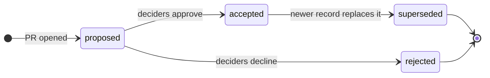
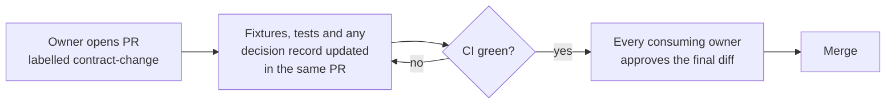

# TraceMem working agreement

**Status: proposed.** This agreement takes effect only when the team ratifies it and records that in a decision record (see [Section 1](#1-decisions-live-in-decision-records)). Until then, treat every rule below as a suggestion.

TraceMem studies one failure: a record that has been replaced keeps being read as current. A five- or six-person project that runs for about seven weeks (to be confirmed against the course schedule) produces the same failure in its own coordination. A schema changes and one component keeps the old shape. A benchmark scenario is edited after a prompt was tuned on it. A decision made in a chat thread never reaches the person who builds on it. This agreement sets the few rules that keep the repository's own records current, so that the experiment's results can be trusted.

The agreement guards against three kinds of failure:

| Failure | What it looks like in this project | Sections |
|---|---|---|
| Components that do not fit | The extractor emits a field the resolver does not read; integration in week 6 fails | [2](#2-interfaces-are-contracts), [7](#7-branches-reviews-and-ci) |
| Results that cannot be trusted | Prompts tuned on test scenarios; a scorer bug that favours one system; a number in the report that no run produced | [3](#3-the-benchmark-is-built-first-and-the-test-split-is-sealed), [4](#4-every-reported-number-comes-from-a-saved-run), [5](#5-the-scorer-must-be-able-to-fail) |
| Decisions that go stale | Two teammates build on two versions of the same decision | [1](#1-decisions-live-in-decision-records), [9](#9-communication), [10](#10-how-the-team-runs) |

Two further sections cover the public repository ([6](#6-the-repository-is-public)) and AI coding assistants ([8](#8-ai-coding-assistants)).

## 1. Decisions live in decision records

A decision that affects more than one person is written as a numbered file in [`docs/decisions/`](decisions/README.md). A chat message is not a decision record, because a chat message cannot be superseded: nothing marks it as replaced when the team changes its mind.

Each record carries its status and its links as data in its front matter:

```yaml
id: 7
title: Store memory as an append-only operation log
status: accepted          # proposed | accepted | superseded | rejected
date: 2026-10-02
decided_by: [team]        # roles (e.g. benchmark lead) or GitHub handles; never full names
supersedes: [3]
superseded_by: []
```

The lifecycle mirrors the one TraceMem gives to project memories:



*The diagram shows how one decision record changes status. A record is never deleted; replacement is a new record plus a link in both directions.*

Four rules follow from treating decisions as data:

1. **Never rewrite an accepted decision.** Fix a typo freely. To change the substance, write a new record that lists the old one in `supersedes`, and in the same pull request set the old record's `status` to `superseded` and its `superseded_by` to the new id.
2. **Link in both directions.** A reader who opens the old record must learn that it has a successor without searching. The checker `scripts/check_decisions.py` fails CI when a link goes one way only, when a superseded record has no successor, or when an accepted record does not say who decided it.
3. **Say who decided.** `decided_by` separates a suggestion from a decision, which is the same distinction TraceMem's resolver must learn.
4. **Match the decider to the scope.** A component owner decides inside the component. A change to a shared contract, a metric, the benchmark split, or the research scope needs every affected owner, and a change to the research questions needs the whole team. [Section 10](#10-how-the-team-runs) says what happens when an approval stalls.

The team should make these decisions in week 1. They may share one record, as long as each is stated separately:

- which proposal version is current, with the older draft marked superseded;
- group size and role allocation;
- the memory record schema and the meaning of ADD, KEEP, SUPERSEDE and FLAG;
- whether systems receive the list of item keys (`tracemem run --vocabulary keys|none`);
- benchmark categories, per-author quotas, and the rule that splits development from test scenarios;
- the answer model, the embedding model, the model family used to paraphrase scenarios (a different family from the one under test), and the API budget;
- the primary metrics and the full metric list, fixed before any test run.

## 2. Interfaces are contracts

Four files define how components talk to each other: [`schema.py`](../src/tracemem/schema.py) holds every data type that crosses a component boundary, [`components.py`](../src/tracemem/components.py) holds the component interfaces, [`ops.py`](../src/tracemem/ops.py) defines what each memory operation does, and [`systems/base.py`](../src/tracemem/systems/base.py) holds the interface every compared system offers the harness. Components exchange only these types, and a component that needs a new field asks for a contract change instead of adding the field locally.

A contract change follows one path:



*The diagram shows the only route by which a shared type changes. Nothing merges while a consumer's tests fail, and approvals apply to the final, tested diff.*

The repository owner can make GitHub enforce the approval step by listing the owners of the four contract files in `.github/CODEOWNERS` (GitHub handles only) and turning on "Require review from Code Owners".

The benchmark's gold data doubles as a stand-in for every stage. The gold candidates are what extraction must output and what resolution reads; the gold operations are what resolution must output and what storage applies. Each owner can therefore build and score a stage before the stage upstream of it is finished, and integration never waits for a teammate. [`docs/interfaces.md`](interfaces.md) explains the stand-ins.

## 3. The benchmark is built first, and the test split is sealed

The benchmark comes before system tuning, because every component is scored against it and every fairness claim rests on it. The authoring guide is [`docs/benchmark.md`](benchmark.md).

- **Scenarios are synthetic.** No real names, student IDs, e-mail addresses, or copied private conversations appear in a scenario.
- **The script comes first.** An author writes what happens (who decides, suggests, revises or disputes what, and when) before writing any dialogue. `tracemem replay` computes the expected answers from the script; nobody types an expected answer into a scenario.
- **Validation is automatic.** `tracemem validate` runs in CI and rejects a scenario whose turns, links, or questions are inconsistent.
- **Review is blind on a sample.** A reviewer who has not seen the script labels what each turn does and answers the checkpoint questions from the dialogue alone. Disagreement means a definition is ambiguous, and the team fixes the definition before writing more scenarios.
- **LLM-rendered dialogue gets a human check.** When a language model paraphrases scripted turns, it comes from a different model family from the one under test, and a person checks every rendered turn against the script.
- **Whoever tunes a compared system writes development scenarios only.** "Tuning" covers prompts, context formats, retrieval settings and classification rules, for TraceMem and for every baseline.
- **Test scenarios stay outside this repository until the freeze.** Anything committed here can be read by everyone, including the people who write prompts. The test authors keep their scenarios elsewhere; at sealing, a decision record commits only a SHA-256 digest of each file (`benchmark/scenarios/test/SHA256SUMS`). After the freeze tag, the files are added in a commit that changes nothing else, and anyone can check them against the digests. Changes to a test scenario are reviewed only by another test author.

## 4. Every reported number comes from a saved run

- **The README names the commands** that run each system and build every table.
- **Every run writes a manifest** into its output folder: the git commit, whether the tree had uncommitted changes, the system and its configuration, the item-vocabulary setting, the freeze tag, and the date. Systems that call models add their model identifiers and prompt hashes through a `describe()` hook.
- **Raw outputs are saved** next to the manifest, and report figures are generated from them. Nobody copies a number into the report by hand.
- **Model calls are cached** by model, prompt hash and input hash. The cache saves money and makes reruns repeatable; the final cache is shared outside git, because it is large.
- **Settings are pinned.** Temperature, seeds where the API supports them, and exact model versions are part of the configuration.
- **Freezing is explicit.** Before the first test run the team tags the repository `freeze-v1`. `tracemem run --split test` refuses to run on uncommitted changes or without a freeze tag, and it appends one line per run to `results/test-runs.jsonl`. Run folders go to `runs/`, which git ignores. So after each test run, the team copies that run's `manifest.json` and `metrics.json` into `results/<run folder>/` and commits them together with `results/test-runs.jsonl`. An override flag exists for emergencies; using it is recorded in the manifest and the log, and needs a decision record. A change to prompts or settings after the tag needs a decision record and invalidates earlier test results.

## 5. The scorer must be able to fail

A scorer that cannot fail cannot tell good systems from bad ones. The repository ships probe systems: simple rules that read the benchmark's own labels, with known scores. The tests run them on every change, and none of them is ever reported as a baseline.

- The **oracle** answers with the expected answer. It must score perfectly.
- The **always-oldest** probe answers with the first value ever stated for the item. It must be scored stale exactly where its first value was replaced and not later restored.
- The **latest-candidate** probe answers with the newest value that would become a memory record, whatever the speaker meant. It fails wherever a recency baseline over records fails, so **the share of questions it gets wrong is the room TraceMem has to beat recency**. If it gets almost everything right, the benchmark cannot separate TraceMem from recency, and more trap scenarios are needed.
- The **latest-mention** probe answers with the newest value named in any turn, including questions and recollections. It measures recency over raw turns, which matters for the full-history reference.
- The **always-conflict** and **always-none** probes never commit to a value. They score zero on the stale, incorrect-replacement, presented-as-current and false-certainty rates, and always-conflict also scores 100% on the false-conflict rate. Their non-answer rates are near 100%: 45 of 46 pilot questions for always-conflict, which is right only on the one open dispute, and all 46 for always-none. This shows why an error rate is never read without the non-answer rate beside it.

A new metric arrives with a test that fails on a deliberately wrong implementation.

## 6. The repository is public

Anything pushed to GitHub can be copied, cached, and indexed, and deleting it later does not undo that.

- **Never commit secrets.** API keys live in a local `.env` file, which `.gitignore` excludes. A key that reaches GitHub is compromised: revoke and rotate it at once, because rewriting history does not recall a copy that has already been fetched.
- **Never commit personal data.** Student IDs, e-mail addresses and phone numbers stay out of code, data, logs, decision records and commit messages; the proposal document, which lists student IDs, stays out of the repository. `scripts/check_public.py` runs in CI and fails on student-ID-like strings, e-mail addresses and home-directory paths. CI runs only after a push, when the content is already public, so each member should also install a local pre-push hook that runs `python scripts/check_public.py` ([CONTRIBUTING.md](../CONTRIBUTING.md) shows how).
- **Keep bulky raw outputs out of git.** Summary results and small fixtures belong in the repository; model-call caches and large raw logs do not.
- **Check licences** before committing a copy of any external dataset, and choose a licence for the repository itself; without one, nobody else may reuse the code.

## 7. Branches, reviews and CI

- `main` stays green. Work happens on branches and reaches `main` through pull requests.
- Pull requests stay small, and each one gets at least one reviewer, preferably the teammate who consumes the changed output. Reviews happen within 48 hours; after that, any other member may review.
- CI runs the tests, the scenario validator, the decision-record checker and the public-content check. The repository owner should enable branch protection so that a failing check blocks the merge, and turn on GitHub's secret scanning.
- A pull request is done when its tests pass, its fixtures and documentation are updated, and any decision it embodies has a record.

## 8. AI coding assistants

Coding assistants are useful here, and they also produce plausible code that nobody on the team understands. Follow the course policy on AI use; the rules below add to it and never override it.

- The person who opens a pull request owns every line in it and can explain it in review.
- The final report discloses how AI assistants were used, including for scenarios and for code.
- Assistants follow [`AGENTS.md`](../AGENTS.md), which repeats the guardrails that matter most for automated edits: never read or tune on test scenarios, never change contracts silently, never commit secrets, and run the checks before proposing a change.
- No AI-generated scenario enters the test split without a human check against its script.
- Nobody pastes API keys or teammates' personal information into an assistant.

## 9. Communication

- **Every identifier carries its gloss.** Write "S2-T3 ('Maybe we could try DistilBERT?')", not a bare "S2-T3". A bare id forces the reader to look it up, and a reader who guesses guesses wrong.
- **Cite where an item is written down.** Refer to an issue by its number and title, and to a decision by its record, so that the reference survives after the chat scrolls away.

## 10. How the team runs

- **One weekly check-in** of 30 minutes on a fixed day. The scribe keeps the notes and posts the week's action list (each item, its owner and its due date) to the team's chat group; anyone who spots a mistake replies within 24 hours. The notes stay out of this repository: it is public, and the notes say who is blocked or late. The team compares progress with the plan's milestones, which live as GitHub milestones.
- **A rotating scribe** turns decisions made in the check-in or in chat into decision records within 24 hours. A record that moves work from one person to another gives a neutral reason, such as balancing the load.
- **Approvals do not stall.** An affected owner answers a contract or metric change within 48 hours; after one reminder, silence counts as consent. Team-level decisions go by majority after discussion, and the record notes any dissent. A disagreement the team cannot settle goes to the teaching assistant.
- **Missed deadlines are announced, not discovered.** An owner who will miss a deadline says so at least 24 hours ahead. Downstream work continues on the gold stand-ins meanwhile. A critical-path task that slips twice is reassigned or split at the next check-in.
- **The agreement itself is reviewed** at the week-4 check-in, and any change goes through a decision record.
